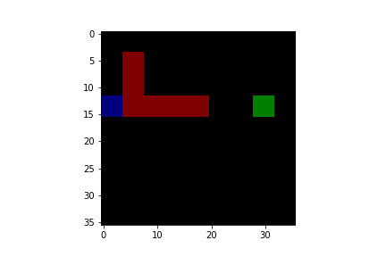
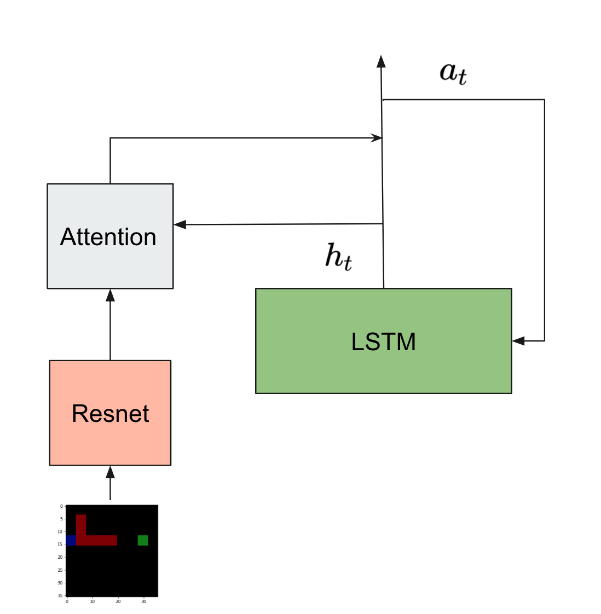
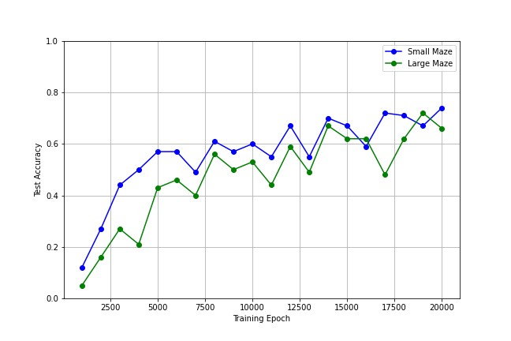
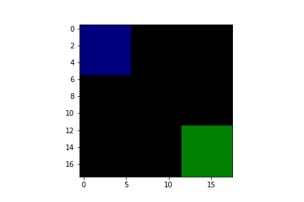
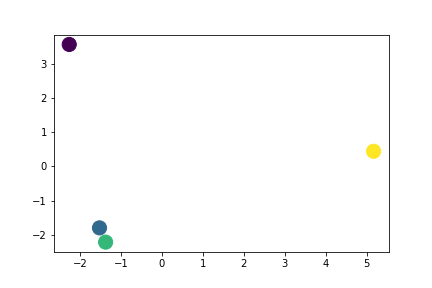
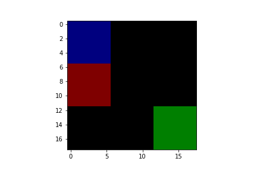
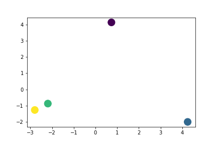
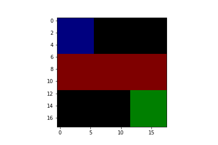
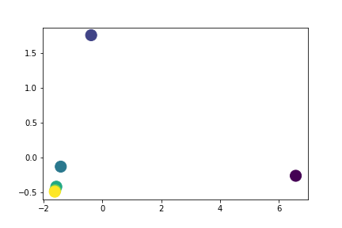

# Readme
Implementation of a simple visual navigation task.

# Task Description
At each step, the agent is given a maze image with its current location(blue block), walls(red block) and the goal location(green block). The agent is then asked to generate actions that lead to the goal.

Example of image input:

# Model Structure
The input image is fed into a pretrained resnet to generate feature maps. The LSTM takes in the previous action and generate attention maps to attend to the feature maps and generate actions accordingly.

# Training
The model is trained on 20000 different 9*9 mazes with imitation learning. The imitation learning's labels are generated  with a simple greedy search. The model is then tested on both large mazes (9\*9) and small mazes(3\*3). The model succeeds if it can reach the goal within 10 steps otherwise fails.

Model's performance with different training epochs:

# PCA Analysis of Hidden States
2-Dim pca on the hiddent states after it takes a sequence of actions. The sequence is colored as :

## Maze without walls
Maze image:

Generated actions: down->down->right->right

PCA results:

## Maze with walls
Maze image:

Generated actions: right->down->down->right

PCA results:

## Blocked maze
Maze image:

Generated actions: right->right->right->right->right->right

PCA results:

